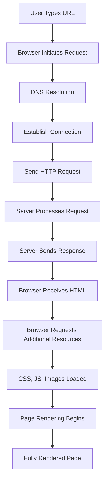
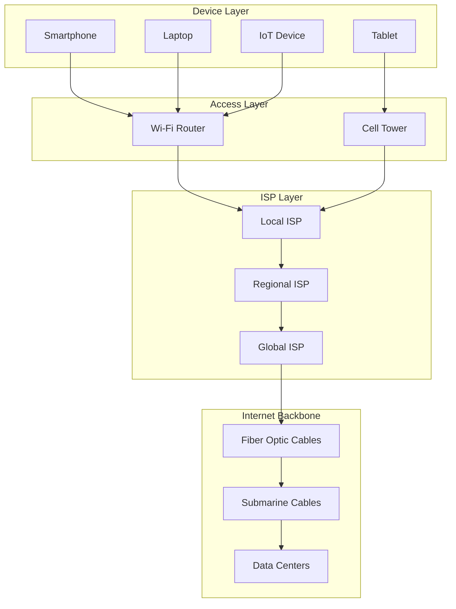
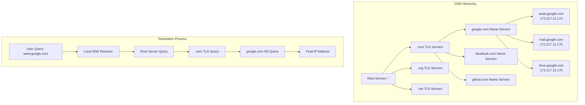
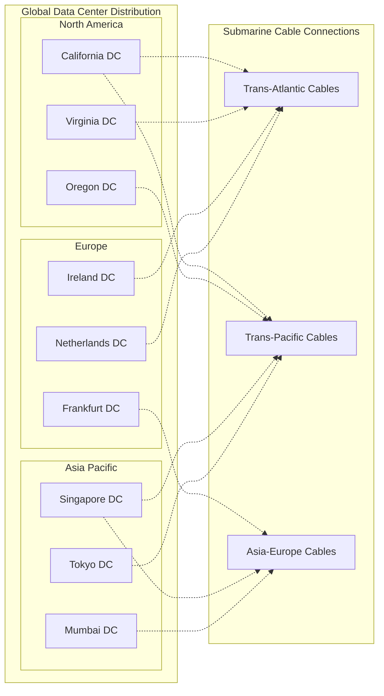
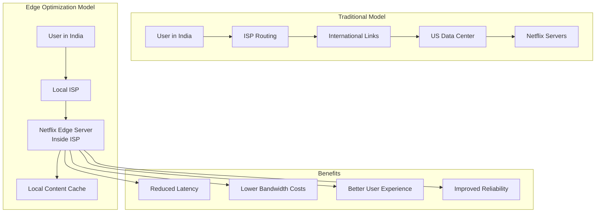

# How the Web Works: Complete In-Depth Guide

> A comprehensive tutorial covering the internal mechanics of the web, from typing a URL to rendering a webpage. This guide covers client-server interactions, networking fundamentals, DNS resolution, server infrastructure, ISP architecture, and browser rendering processes.

## Table of Contents

1.  [Introduction and High-Level Overview](https://github.com/akshadjaiswal/Frontend-System-Design/tree/main/01%20Networking/02%20How%20the%20Web%20works#1-introduction-and-high-level-overview)
2.  [Networking Basics: Connecting Devices](https://github.com/akshadjaiswal/Frontend-System-Design/tree/main/01%20Networking/02%20How%20the%20Web%20works#2-networking-basics-connecting-devices)
3.  [DNS (Domain Name System) in Depth](https://github.com/akshadjaiswal/Frontend-System-Design/tree/main/01%20Networking/02%20How%20the%20Web%20works#3-dns-domain-name-system-in-depth)
4.  [Servers and Data Centers](https://github.com/akshadjaiswal/Frontend-System-Design/tree/main/01%20Networking/02%20How%20the%20Web%20works#4-servers-and-data-centers)
5.  [ISP Architecture and Optimizations](https://github.com/akshadjaiswal/Frontend-System-Design/tree/main/01%20Networking/02%20How%20the%20Web%20works#5-isp-architecture-and-optimizations)
6.  [Browser-Side Processes: From Request to Render](https://github.com/akshadjaiswal/Frontend-System-Design/tree/main/01%20Networking/02%20How%20the%20Web%20works#6-browser-side-processes-from-request-to-render)
7.  [Advanced Insights and Real-World Applications](https://github.com/akshadjaiswal/Frontend-System-Design/tree/main/01%20Networking/02%20How%20the%20Web%20works#7-advanced-insights-and-real-world-applications)

----------

## 1. Introduction and High-Level Overview

### Understanding the Client-Server Architecture

The foundation of the entire web is built upon the client-server model, which represents one of the most fundamental concepts in distributed computing. When we talk about the web, we're essentially discussing a massive network of clients and servers communicating with each other across the globe.

**The Client** represents the requesting side of this relationship. In most cases, this is your web browser - whether it's Chrome, Firefox, Safari, or Edge - running on your personal device. The client's primary responsibility is to initiate communication by sending requests and then process the responses it receives. Think of the client as the customer in a restaurant who places an order and waits for the food to arrive.

**The Server** is the responding side of this relationship. It's a specialized computer program running on powerful hardware that's designed to handle incoming requests, process them according to specific logic, and send back appropriate responses. The server is like the kitchen in our restaurant analogy - it receives orders, prepares the requested items, and sends them back to the customer.

### The Web Request Lifecycle Explained

When you type a URL like `google.com`, `linkedin.com/engineer/chirag`, or `flipkart.com` into your browser's address bar, you're initiating a complex chain of events that happens in milliseconds. Let's break down this process step by step.

First, your browser must determine where to send the request. This involves DNS resolution (which we'll cover in detail later) to convert the human-readable domain name into an IP address that computers can understand. Once the browser knows where to send the request, it establishes a connection with the target server.

The initial request is typically an HTTP GET request for the main HTML document. This HTML serves as the skeleton or structure of the webpage - it contains the basic layout, text content, and references to other resources like CSS files, JavaScript files, and images.

When the server receives this request, it processes it according to its programmed logic. For a simple static website, this might just involve reading an HTML file from disk and sending it back. For dynamic websites, the server might query databases, perform calculations, personalize content based on user data, or execute complex business logic before generating the HTML response.

### Understanding Web Resources

The response that comes back from the server typically includes several types of resources, each serving a specific purpose in creating the final webpage experience:

**HTML (HyperText Markup Language)** provides the structural foundation of the webpage. It defines the content hierarchy, includes the actual text that users will read, and specifies where different elements should be positioned. Think of HTML as the blueprint of a house - it shows where the rooms go, but doesn't specify colors, furniture, or decorative elements.

**CSS (Cascading Style Sheets)** handles all the visual presentation aspects of the webpage. This includes colors, fonts, spacing, layout positioning, animations, and responsive design rules. CSS transforms the basic HTML structure into a visually appealing design. Continuing our house analogy, CSS is like the interior design - it makes the blueprint into a beautiful, livable space.

**JavaScript** brings interactivity and dynamic behavior to the webpage. It can respond to user actions like clicks and form submissions, modify the page content after it loads, make additional requests to servers without refreshing the page, and create complex interactive features like image sliders, modal dialogs, and real-time updates. JavaScript is like the electrical and smart home systems - it makes everything functional and responsive to user needs.

### Browser Developer Tools: Your Window into Web Communication

Modern browsers provide powerful developer tools that allow you to observe and analyze all of these processes in real-time. The Network tab in Chrome DevTools is particularly valuable for understanding web communication patterns.

When you open the Network tab and refresh a webpage, you'll see a waterfall chart showing every request your browser makes. The first request is typically for the main HTML document, followed by subsequent requests for CSS files, JavaScript files, images, fonts, and other assets referenced in the HTML.

This visualization helps you understand that loading a webpage isn't a single request-response cycle, but rather a complex orchestration of multiple requests happening in parallel and in sequence. You can observe how different resources are prioritized, which ones block rendering, and how long each request takes to complete.

### The Server Perspective: More Than Just a Computer

While we often think of servers as just "computers on the internet," they're actually sophisticated systems designed for specific purposes. A server is essentially a high-performance computer that's optimized for handling multiple simultaneous requests reliably and efficiently.

Unlike your personal laptop or desktop computer, servers are built with enterprise-grade components designed for continuous operation. They typically have multiple CPUs, large amounts of RAM, redundant storage systems, and uninterruptible power supplies. They're housed in climate-controlled data centers with backup generators, multiple internet connections, and 24/7 monitoring.

The key difference between your laptop and a server isn't just the hardware specifications - it's the software and configuration. Servers run specialized server software (like Apache, Nginx, or custom applications) that's optimized for handling web requests efficiently. They're configured to handle thousands or even millions of concurrent connections, automatically scale resources based on demand, and maintain high availability even when individual components fail.

While your laptop could theoretically function as a server (and developers often run local servers for testing), it's not practical for production use. Personal computers aren't designed for the reliability, security, and performance requirements of serving content to users around the world.



This high-level overview provides the foundation for understanding all the detailed processes we'll explore in the following sections. Each step in this simple flow actually involves numerous complex sub-processes that work together to deliver the seamless web experience we've come to expect.

----------

## 2. Networking Basics: Connecting Devices

### The Fundamental Role of IP Addresses

Internet Protocol (IP) addresses serve as the foundational addressing system that makes global internet communication possible. Every device that connects to the internet - whether it's your smartphone, laptop, smart TV, IoT device, or a massive server in a data center - must have a unique IP address to participate in network communication.

An IP address functions much like a postal address in the physical world. Just as your home address allows mail carriers to deliver packages to the correct location, an IP address allows data packets to be routed through the complex network of networks that comprises the internet to reach the intended destination device.

There are two main versions of IP addresses currently in use: IPv4 and IPv6. IPv4 addresses consist of four numbers separated by dots (like 192.168.1.1 or 8.8.8.8), while IPv6 addresses are longer and use hexadecimal notation (like 2001:0db8:85a3:0000:0000:8a2e:0370:7334). IPv4 provides about 4.3 billion unique addresses, which seemed like plenty when the internet was first designed, but with the explosion of connected devices, we're transitioning to IPv6, which provides an virtually unlimited number of addresses.

The pizza delivery analogy mentioned in the tutorial is particularly apt: when you order pizza, you provide your address (PIN code) so the delivery person knows exactly where to bring your order. Similarly, when a server needs to send data to your device, it uses your device's IP address to ensure the data reaches the correct destination among billions of connected devices worldwide.

### Domain Names: Making the Internet Human-Friendly

While IP addresses are perfect for computers, they're terrible for humans. Imagine if you had to remember that Google's search engine is located at 142.250.190.78, Facebook is at 157.240.12.35, and GitHub is at 140.82.112.3. This would make the internet practically unusable for most people.

Domain names solve this problem by providing human-readable aliases for IP addresses. When you type google.com into your browser, you're using a domain name that's much easier to remember than the underlying IP address. The domain name system automatically translates these friendly names into the IP addresses that computers need for communication.

Domain names also provide flexibility and abstraction. A company can change their server infrastructure, move to different IP addresses, or distribute their services across multiple servers, all while keeping the same domain name. Users don't need to know or care about these technical details - they can always access Google by typing google.com, regardless of what's happening behind the scenes.

### Internet Connectivity: The Physical and Logical Infrastructure

Understanding how devices actually connect to the internet requires examining both the physical infrastructure and the logical protocols that enable communication.

#### Mobile Device Connectivity

When you use your smartphone to access the internet, your device connects to the nearest cell tower operated by your mobile service provider (like Airtel, Jio, Verizon, or T-Mobile). These cell towers are essentially radio antennas that can communicate with mobile devices within a certain radius, typically a few kilometers in urban areas or much larger distances in rural areas.

Your mobile device and the cell tower communicate using radio frequencies, with your device transmitting data when you make requests and receiving data when servers send responses. The cell tower acts as a gateway, forwarding your internet requests through the mobile carrier's network infrastructure to the broader internet.

The quality and speed of your mobile internet connection depend on several factors: your distance from the cell tower, the number of other users sharing the same tower, the radio frequency bands being used, and weather conditions that can interfere with radio signals.

#### Wi-Fi and Home Network Connectivity

Wi-Fi connectivity involves a more complex but often more reliable setup. In a typical home network, multiple devices (laptops, smartphones, smart TVs, gaming consoles, IoT devices) connect wirelessly to a central router. This router serves as the hub of your local network and manages communication between your devices and the internet.

The router itself connects to your Internet Service Provider (ISP) through a physical connection. In modern setups, this is often a fiber optic cable that provides high-speed, reliable connectivity. In older setups, this might be a cable modem connected to coaxial cables or a DSL modem connected to traditional phone lines.

Your router performs several critical functions: it assigns local IP addresses to devices on your network (using DHCP - Dynamic Host Configuration Protocol), manages traffic between your devices and the internet, provides wireless access through Wi-Fi radio signals, and often includes firewall functionality to protect your network from external threats.

#### The Strategic Balance of Wired vs Wireless

The internet's infrastructure represents a carefully planned balance between wired and wireless technologies, each optimized for different scenarios and requirements.

**Wired infrastructure** forms the backbone of the internet. Fiber optic cables carry data over long distances with minimal signal degradation, high reliability, and resistance to weather conditions. These cables connect countries, cities, and major network infrastructure points. The speed of light transmission through fiber optic cables means that data can travel from one continent to another in milliseconds.

**Wireless infrastructure** provides the "last mile" connectivity that makes the internet accessible to end users. Wi-Fi networks, cellular towers, and satellite connections allow devices to connect without physical cables, providing mobility and convenience. However, wireless signals are more susceptible to interference, have limited range, and can be affected by weather conditions, physical obstacles, and electromagnetic interference.

The hybrid approach used throughout the internet maximizes the benefits of both technologies. Long-distance, high-capacity communication uses wired fiber optic infrastructure for reliability and speed, while wireless technologies provide flexible access for end users.

### Network Scaling in Complex Environments

Large buildings, office complexes, and residential communities face unique challenges in providing internet connectivity to many users efficiently. The concept of "network hell" - where every device would need its own cable connection - is avoided through intelligent network design.

A typical enterprise or residential complex uses a hierarchical network design. A high-speed fiber connection comes into the building and connects to a central network hub or switch. From this central point, wired connections (often using Ethernet cables) distribute connectivity to different floors or areas of the building.

At each floor or area, local routers or access points provide Wi-Fi coverage for end-user devices. This design provides the reliability and speed of wired infrastructure for the high-traffic backbone while offering the convenience of wireless access where users actually connect their devices.

This hierarchical approach also makes network management more efficient. Network administrators can monitor and control traffic at various levels, implement security policies consistently, and troubleshoot problems more effectively by isolating issues to specific network segments.



The beauty of this system is that it abstracts away the complexity from end users. When you want to watch a video on YouTube, you don't need to understand the complex routing that happens between your device and Google's servers - you just click play, and the infrastructure handles the rest.

----------

## 3. DNS (Domain Name System) in Depth

### DNS: The Internet's Address Translation System

The Domain Name System represents one of the most critical and ingenious components of internet infrastructure. Without DNS, the internet as we know it simply couldn't exist in a user-friendly form. To truly understand how the web works, we need to dive deep into how DNS operates, why it's structured the way it is, and how it scales to handle billions of requests daily.

Imagine if you had to remember the phone number of every person you wanted to call, rather than being able to look up their name in your contacts. That's essentially what the internet would be like without DNS - you'd need to memorize IP addresses like 172.217.12.174 for Google, 31.13.66.35 for Facebook, and 140.82.112.3 for GitHub. DNS serves as the internet's phone book, automatically translating human-readable domain names into the IP addresses that computers use for communication.

### The DNS Resolution Process: A Step-by-Step Journey

When you type a domain name into your browser, a sophisticated process begins that involves multiple systems working together to resolve that name to an IP address. This process, called DNS resolution, typically happens so quickly that users don't even notice it, but understanding each step reveals the elegant engineering behind the internet's addressing system.

The process begins when your browser recognizes that you've entered a domain name rather than an IP address. Before reaching out to external DNS servers, your browser first checks its own cache to see if it has recently resolved this domain name. Browser DNS caches typically store results for a few minutes to several hours, depending on the TTL (Time To Live) value set by the domain owner.

If the domain isn't in the browser cache, the request moves to your operating system's DNS cache. Your OS maintains its own cache of recent DNS lookups, which can provide faster resolution for frequently accessed domains. This cache is shared among all applications on your device, so if another program recently looked up the same domain, your browser can benefit from that cached result.

When neither the browser nor OS cache contains the required information, your device sends a DNS query to your configured DNS resolver. This is typically your ISP's DNS server, though many users configure alternative DNS providers like Google's 8.8.8.8, Cloudflare's 1.1.1.1, or other public DNS services for better performance or privacy.

### DNS Hierarchy: Understanding the Domain Structure

Domain names follow a hierarchical structure that mirrors the distributed nature of DNS servers. This hierarchy is designed to be both scalable and manageable, allowing different organizations to control different levels of the naming system.

Reading from right to left, a domain name like `www.blog.example.com` breaks down into several components:

**The Root Level** is represented by a dot (.) that's usually invisible to users. The root level is managed by the Internet Assigned Numbers Authority (IANA) and serves as the starting point for all DNS resolution. Root DNS servers know where to find the authoritative servers for all top-level domains.

**Top-Level Domains (TLDs)** like `.com`, `.org`, `.net`, `.edu`, and country-specific domains like `.uk`, `.in`, or `.jp` represent the highest visible level of the domain hierarchy. Each TLD is managed by a registry organization that maintains the authoritative database of all second-level domains within that TLD. For example, VeriSign manages the `.com` and `.net` TLDs.

**Second-Level Domains** like `google`, `facebook`, or `github` are what most people think of as the main part of a domain name. Organizations purchase the rights to use these names within a specific TLD from domain registrars, who act as intermediaries between domain buyers and the TLD registries.

**Subdomains** like `www`, `mail`, `api`, or `blog` allow organizations to create logical divisions within their domain space. A company might use `www.example.com` for their main website, `mail.example.com` for email services, `api.example.com` for their programming interface, and `blog.example.com` for their company blog. Each subdomain can point to different IP addresses, allowing for flexible service architecture.

### The DNS Server Hierarchy in Action

The DNS system uses a distributed hierarchy of servers to resolve domain names efficiently. This design ensures that no single server needs to know about every domain on the internet, while still providing a reliable way to resolve any valid domain name.

When your DNS resolver receives a query for a domain it doesn't have cached, it begins a process called recursive resolution. The resolver starts by contacting one of the 13 root DNS servers distributed around the world. These root servers don't know the IP address for specific domains, but they know which TLD servers are authoritative for each top-level domain.

The root server responds with the address of the appropriate TLD server. For a `.com` domain, this would be one of VeriSign's `.com` TLD servers. The resolver then contacts the TLD server, which doesn't know the specific IP address either, but knows which name servers are authoritative for the second-level domain.

The TLD server responds with the address of the domain's authoritative name servers. These are typically managed by the domain owner or their hosting provider. Finally, the resolver contacts the authoritative name server, which provides the actual IP address for the requested domain.

This entire process might involve 4-6 separate network requests, but it typically completes in under 100 milliseconds due to the distributed nature of DNS infrastructure and extensive caching at every level.



### ICANN and Internet Governance

The Internet Corporation for Assigned Names and Numbers (ICANN) plays a crucial role in maintaining the stability and security of the internet's addressing systems. ICANN coordinates the global DNS system, manages the allocation of IP address blocks, and oversees the policies that govern how domain names are registered and managed.

ICANN doesn't directly control day-to-day DNS operations, but it establishes the policies and contracts that govern how TLD registries and domain registrars operate. This includes setting standards for domain registration processes, establishing dispute resolution procedures for domain name conflicts, and ensuring that the technical infrastructure remains stable and secure.

The organization operates through a multi-stakeholder model that includes input from governments, businesses, technical experts, and civil society organizations from around the world. This approach helps ensure that internet governance reflects the global nature of the internet while maintaining technical stability.

### WHOIS: The Domain Information Database

WHOIS is a query and response protocol that provides access to databases containing information about domain name registrations, IP address allocations, and autonomous system numbers. For anyone working with web technologies, WHOIS serves as an invaluable tool for research, security analysis, and technical troubleshooting.

When you perform a WHOIS lookup on a domain, you can discover when the domain was first registered, when it's set to expire, which registrar was used for registration, and contact information for the domain owner (though this is often masked for privacy protection). This information proves particularly valuable for security analysis and fraud detection.

For example, if you encounter a website claiming to be an established business that's been operating for many years, a WHOIS lookup might reveal that the domain was actually registered just a few weeks ago. This discrepancy could indicate a fraudulent website attempting to deceive users about its legitimacy.

WHOIS data also helps with technical troubleshooting. If you're experiencing issues accessing a particular website, WHOIS can help you identify the domain's name servers, which might reveal configuration problems or help you contact the appropriate technical personnel.

Many domain registrars now offer privacy protection services that mask personal information in WHOIS databases, replacing actual contact details with proxy information provided by the registrar. This protects domain owners from spam and privacy invasions while still maintaining the technical information needed for internet operations.

### DNS Caching: Performance Through Intelligent Storage

DNS caching occurs at multiple levels throughout the internet infrastructure, and understanding these caching layers is crucial for both performance optimization and troubleshooting connectivity issues.

**Browser-level caching** stores DNS results locally within your web browser. When you visit a website, your browser remembers the IP address for that domain for a specified period (usually 5-30 minutes). This means that if you navigate to different pages on the same website, your browser doesn't need to perform DNS lookups for each page load.

**Operating system caching** maintains a system-wide DNS cache that's shared among all applications on your device. This cache typically has a longer lifetime than browser caches and can benefit multiple programs simultaneously. For example, if your email client looks up the IP for your email provider, your web browser can use that cached result if you visit the email provider's website.

**Router and ISP caching** extends this concept to the network level. Your home router often caches DNS results for all devices on your network, while your ISP maintains much larger caches that serve all their customers. These caches significantly reduce the load on authoritative DNS servers and improve response times for popular websites.

The Time To Live (TTL) value associated with each DNS record determines how long the result can be cached at each level. Domain owners can configure TTL values based on how frequently they expect to change their DNS records. A website that rarely changes servers might use a TTL of 24 hours, while a service that needs flexibility for load balancing might use a TTL of just 5 minutes.

----------

## 4. Servers and Data Centers

### Understanding Server Hardware and Architecture

When we talk about servers in the context of web infrastructure, we're referring to specialized computer systems that are fundamentally different from personal computers in their design, capabilities, and intended use. While the basic computing principles remain the same, servers are engineered to meet the demanding requirements of serving content to potentially millions of users simultaneously.

Server hardware is built with redundancy and reliability as primary concerns. Unlike consumer computers that might use a single CPU, servers often feature multiple processors (sometimes dozens of cores) that can handle many tasks in parallel. Memory configurations in servers are designed for high throughput and often include error-correcting memory modules that can detect and fix certain types of data corruption automatically.

Storage systems in servers typically use enterprise-grade drives arranged in RAID (Redundant Array of Independent Disks) configurations. RAID provides both performance improvements through data striping across multiple drives and fault tolerance through redundancy - if one drive fails, the system continues operating without data loss while the failed drive is replaced.

Power systems in servers include redundant power supplies and battery backup systems. If the primary power supply fails, a secondary supply immediately takes over without interrupting server operation. Battery systems provide power during brief outages while backup generators start up for extended power failures.

The most noticeable difference when you see actual servers is the absence of monitors, keyboards, and mice. Servers are designed for "headless" operation and are managed remotely through network connections. This allows data center operators to pack many more servers into the same physical space and reduces potential points of failure.

### Data Center Infrastructure and Design

Data centers represent the physical foundation of the internet's server infrastructure. These facilities are engineered to provide the optimal environment for running thousands of servers reliably and efficiently.

**Physical Environment Control** is critical in data centers. Servers generate significant heat during operation, and excessive heat can cause performance degradation or hardware failure. Data centers use sophisticated cooling systems including precision air conditioning, hot aisle/cold aisle layouts that optimize airflow, and in some cases, liquid cooling systems for high-density server deployments.

**Power Infrastructure** in data centers goes far beyond what you'd find in typical buildings. Data centers require massive amounts of electrical power to run servers and cooling systems. They typically have multiple power feeds from different electrical grids, on-site backup generators that can run for days or weeks, and uninterruptible power supply (UPS) systems that provide clean, consistent power and bridge any gaps between utility power loss and generator startup.

**Network Connectivity** within data centers uses high-speed switches and routers to connect servers to each other and to the internet. Data centers typically have multiple internet connections from different ISPs to ensure that connectivity remains available even if one provider experiences problems. These connections often operate at speeds of 10 Gbps, 40 Gbps, or even 100 Gbps per link.

**Physical Security** measures include controlled access systems, 24/7 security personnel, surveillance systems, and sometimes even biometric access controls. The servers in these facilities often contain sensitive customer data and represent significant financial investments, making physical security a critical concern.

### Load Balancing and Traffic Distribution

Modern web applications receive far more traffic than any single server could handle effectively. Load balancing solves this problem by distributing incoming requests across multiple servers, ensuring that no single server becomes overwhelmed while others sit idle.

**Round-Robin Load Balancing** is the simplest approach, where requests are distributed sequentially across available servers. Server 1 handles the first request, Server 2 handles the second, Server 3 handles the third, and so on. This works well when all servers have similar capabilities and all requests require similar processing power.

**Weighted Load Balancing** allows for more sophisticated distribution based on server capabilities. If you have servers with different processing power, you can configure the load balancer to send more requests to more powerful servers and fewer requests to less powerful ones.

**Health-Based Load Balancing** continuously monitors server performance and availability. If a server becomes overloaded or experiences problems, the load balancer automatically stops sending new requests to that server until it recovers. This ensures that users don't experience failed requests due to server problems.

**Geographic Load Balancing** routes requests to servers based on the user's physical location. A user in India might be directed to servers in Mumbai or Delhi, while a user in the United States might be directed to servers in California or Virginia. This reduces latency and provides better performance for users worldwide.

### Server Software and Application Architecture

The server hardware we've discussed runs specialized software designed for handling web requests efficiently. This software stack typically includes several layers, each with specific responsibilities.

**Web Server Software** like Apache HTTP Server, Nginx, or Microsoft IIS handles the basic HTTP protocol operations. These programs listen for incoming network connections, parse HTTP requests, and generate appropriate responses. They handle tasks like serving static files (HTML, CSS, images), managing SSL/TLS encryption for HTTPS connections, and routing requests to appropriate application code.

**Application Server Software** executes the custom business logic that makes websites dynamic and interactive. This might be Node.js applications running JavaScript, Python applications using frameworks like Django or Flask, Java applications running on Tomcat, or .NET applications on Windows servers. The application server processes requests that require database access, user authentication, content personalization, or complex calculations.

**Database Management Systems** store and retrieve the data that powers dynamic websites. Popular options include MySQL, PostgreSQL, MongoDB, Redis, and many others. Database servers are often separate from web servers, allowing for specialized optimization of each component and enabling horizontal scaling where multiple web servers can share access to the same database infrastructure.

**Caching Layers** improve performance by storing frequently accessed data in memory or fast storage systems. This might include database query results, rendered HTML pages, or computed values that are expensive to calculate. Popular caching solutions include Redis, Memcached, and application-level caching systems.

### Data Center Geographic Distribution

Major internet companies operate data centers in multiple geographic regions to provide better performance and reliability for their global user base. This geographic distribution involves careful planning to balance performance, cost, legal requirements, and disaster recovery needs.

**Content Proximity** significantly affects user experience. A user in Tokyo accessing a server in Tokyo might experience response times of 10-20 milliseconds, while accessing a server in New York might result in response times of 150-200 milliseconds. For real-time applications like video conferencing or online gaming, this difference is immediately noticeable to users.

**Regulatory Compliance** requirements in different countries often influence data center placement. Some countries require that citizen data be stored within national borders, while others have specific requirements for data encryption, access controls, or government access to stored information.

**Disaster Recovery** planning involves ensuring that if one data center becomes unavailable due to natural disasters, power outages, or other problems, services can continue operating from other locations. This requires sophisticated data replication systems that keep multiple data centers synchronized with current information.

**Economic Factors** including electricity costs, real estate prices, tax policies, and labor costs influence where companies choose to build data centers. Some regions offer significant economic incentives to attract major technology investments.



----------

## 5. ISP Architecture and Optimizations

### The Three-Tier ISP Architecture

Internet Service Providers operate within a hierarchical structure that enables global internet connectivity while maintaining local control and optimization. This three-tier architecture represents one of the most important organizational principles of the modern internet.

**Tier 1 ISPs** represent the top level of this hierarchy and form the internet's backbone infrastructure. These are large, international companies like AT&T, Verizon, NTT, and Cogent that own and operate the major fiber optic networks connecting continents and countries. Tier 1 ISPs have a special characteristic: they don't pay other ISPs for internet connectivity. Instead, they have "peering" agreements with each other, where they exchange traffic freely based on mutual benefit.

Tier 1 ISPs own and maintain the submarine cable systems that connect continents, the major fiber optic routes that cross countries, and the primary internet exchange points where different networks interconnect. These companies invest billions of dollars in infrastructure and have the resources to maintain redundant routes and equipment to ensure internet stability.

**Tier 2 ISPs** operate at the regional or national level and provide internet connectivity to large geographic areas. Examples include companies like Comcast in the United States, BT in the United Kingdom, or Jio and Airtel in India. Tier 2 ISPs have their own substantial infrastructure, but they purchase connectivity from Tier 1 ISPs to reach destinations outside their geographic coverage area.

Tier 2 ISPs often have peering agreements with each other within their regions, allowing them to exchange local traffic without paying transit fees to Tier 1 providers. This regional peering improves performance for local traffic and reduces costs for the ISPs involved.

These ISPs also play a crucial role in content regulation and policy enforcement. Regional ISPs often implement government-mandated content filtering, bandwidth throttling policies, and legal compliance measures. For example, ISPs in China implement the "Great Firewall" content filtering, while ISPs in India might block access to certain websites during legal disputes or security concerns.

**Tier 3 ISPs** represent the local level of internet connectivity, providing services directly to homes, businesses, and smaller organizations. These are often smaller, regional companies that focus on specific metropolitan areas or rural regions. Tier 3 ISPs typically purchase all their connectivity from Tier 2 ISPs and focus on customer service, local infrastructure maintenance, and last-mile connectivity solutions.

Local ISPs face unique challenges in providing connectivity to end users. They must maintain physical infrastructure like fiber optic cables, cable TV systems, or DSL equipment that reaches individual homes and businesses. They also handle customer support, billing, and technical troubleshooting for end users who may have limited technical knowledge.

### Cross-Border Data Flow and Global Routing

When you access a website hosted in another country, your data travels through a complex international network infrastructure that involves multiple ISPs and crossing several national boundaries. Understanding this process reveals both the remarkable engineering of global connectivity and the potential performance implications of geographic distance.

The journey begins with your local ISP, which handles the initial routing of your request. If the destination is within the same country or region, your local ISP might have direct peering agreements that allow efficient routing without involving higher-tier providers. However, for international destinations, the request typically needs to travel through the hierarchical ISP system.

Your local ISP forwards the request to their regional ISP, which examines the destination and determines the best path forward. The regional ISP might have direct international connections for popular destinations, or it might need to route the traffic through a Tier 1 ISP that specializes in international connectivity.

The physical infrastructure that enables this global connectivity consists primarily of submarine fiber optic cables that cross oceans and continents. These cables, laid on the ocean floor at depths of several kilometers, carry the vast majority of international internet traffic. Satellite connections, while available, are generally avoided for regular internet traffic due to their high latency (the time it takes for signals to travel to satellites and back) and susceptibility to weather interference.

The data transmission process involves breaking your request into small packets, each containing a portion of your data along with addressing information. These packets can take different physical routes to their destination, depending on network congestion, equipment availability, and routing policies. At the destination, the packets are reassembled into the original request format.

This packet-based approach provides resilience and efficiency. If one network link becomes congested or fails, packets can be automatically rerouted through alternative paths. The distributed nature of internet routing means that even if several network links fail simultaneously, communication can usually continue through the remaining available paths.

### Advanced ISP Optimizations and Peering

Modern ISPs implement sophisticated optimization strategies that go far beyond simple traffic routing. These optimizations are driven by the need to provide better performance for users while managing infrastructure costs effectively.

**Peering Agreements** represent one of the most important optimization strategies used by major internet companies. Rather than routing all traffic through the standard ISP hierarchy, companies like Google, Netflix, Facebook, and Microsoft establish direct network connections with ISPs around the world.

For example, Google has negotiated peering agreements with hundreds of ISPs globally. When you watch a YouTube video, instead of your request traveling from your local ISP to a regional ISP to a Tier 1 ISP and then to Google's servers, your request might travel directly from your local ISP to Google's infrastructure through a dedicated peering connection.

These peering relationships benefit both parties: ISPs can provide better performance to their customers for popular services, while content providers like Google can ensure reliable, fast access to their services without paying transit fees to intermediate ISPs.

**Internet Exchange Points (IXPs)** facilitate these peering relationships by providing neutral locations where multiple ISPs and content providers can interconnect. Major IXPs like DE-CIX in Frankfurt, AMS-IX in Amsterdam, or Equinix facilities worldwide host hundreds of different networks, enabling efficient traffic exchange without requiring separate physical connections between every pair of networks.

### Edge Hosting and Content Distribution Networks

Content Distribution Networks (CDNs) and edge hosting represent perhaps the most significant performance optimization deployed by major internet companies. These strategies fundamentally change how content is delivered by bringing it closer to end users.

**Netflix's Edge Strategy** provides an excellent example of how content distribution works in practice. Rather than serving all video content from centralized data centers, Netflix has negotiated agreements with ISPs worldwide to install Netflix-owned servers directly within ISP facilities.

These edge servers, sometimes called Open Connect Appliances, store copies of popular movies and TV shows that are frequently watched by users in that geographic region. When a user in Mumbai wants to watch a popular series, instead of streaming the video from Netflix's data centers in the United States (which would involve international data transfer and higher latency), the content is served from servers located within their local ISP's infrastructure.

This approach provides multiple benefits: users experience faster startup times and higher video quality due to reduced network distance, ISPs reduce their international bandwidth costs since popular content doesn't need to be fetched repeatedly from distant servers, and Netflix can provide better service quality while reducing their own bandwidth costs.

The selection of which content to cache at each edge location involves sophisticated algorithms that analyze viewing patterns, predict demand, and optimize storage usage. Netflix continuously updates the content stored at each edge location based on local viewing preferences and seasonal trends.

**Google's Global Cache Infrastructure** operates on similar principles but extends beyond video content to include search results, YouTube videos, Google Drive files, and other Google services. Google operates one of the world's largest networks of cache servers, with points of presence in hundreds of locations worldwide.

Google's edge caching system is particularly sophisticated because it handles both static content (like YouTube videos) and dynamic content (like personalized search results). The system uses machine learning algorithms to predict which content will be popular in different regions and pre-positions that content at edge locations.

### CDN Architecture and Global Distribution

Content Distribution Networks extend the edge hosting concept to provide content acceleration services for websites and applications of all sizes. Companies like Cloudflare, Amazon CloudFront, and Akamai operate networks of servers distributed globally that can cache and serve content on behalf of their customers.

When a website uses a CDN, requests for static assets like images, CSS files, and JavaScript files are automatically routed to the nearest CDN server rather than the website's origin server. This reduces load on the origin server while providing faster content delivery to users.

Modern CDNs provide services beyond simple content caching. They offer DDoS protection by absorbing malicious traffic across their distributed infrastructure, SSL/TLS termination to reduce computational load on origin servers, image optimization that automatically serves appropriately sized images based on user devices, and edge computing capabilities that allow custom code to run on CDN servers close to users.

The economic model of CDNs allows smaller websites to benefit from global infrastructure that would be prohibitively expensive to build independently. A small e-commerce site can provide fast loading times to customers worldwide by using a CDN service, without needing to invest in their own global server infrastructure.



----------

## 6. Browser-Side Processes: From Request to Render

### Pre-Request Caching: The Multiple Layers of Speed Optimization

Before your browser even considers making a network request, it goes through several layers of caching that can dramatically speed up the web browsing experience. Understanding these caching mechanisms is crucial for both web developers optimizing their applications and for anyone troubleshooting web connectivity issues.

**Browser HTTP Cache** represents the first and most immediate layer of caching. When your browser receives responses from web servers, it stores copies of these responses locally on your device's storage. The next time you request the same resource, your browser can serve it instantly from the local cache instead of making another network request.

This cache operates based on HTTP headers sent by the server. The `Cache-Control` header tells the browser how long it can store the resource, while headers like `ETag` and `Last-Modified` allow the browser to check if cached content is still current. A typical CSS file might be cached for several hours or days, while dynamic content like news articles might have much shorter cache lifetimes.

The browser cache is also intelligent about storage management. It automatically removes old or rarely-used cached items when storage space becomes limited, prioritizes caching of resources that are likely to be reused, and respects user privacy settings that might disable or limit caching behavior.

**Service Worker Cache** provides advanced caching capabilities that go beyond traditional HTTP caching. Service workers are JavaScript programs that run in the background and can intercept network requests made by web pages. This allows for sophisticated caching strategies that can provide offline functionality, instant loading for repeat visits, and fine-grained control over how resources are cached and served.

A well-implemented service worker can make web applications feel as fast and responsive as native mobile apps. When you visit a website with a properly configured service worker, subsequent visits can load in under 1 millisecond for cached resources, compared to the 100-500 milliseconds typically required for network requests.

Service workers enable Progressive Web Apps (PWAs) that can function offline or with poor network connectivity. The service worker can serve cached content when the network is unavailable and synchronize data when connectivity is restored.

**Operating System DNS Cache** operates at a lower level than browser caches and stores domain name to IP address mappings. This cache is shared among all applications on your device, so if your email client looks up the IP address for your email provider, your web browser can benefit from that cached result when you visit the email provider's website.

The OS DNS cache typically has longer TTL values than browser caches and survives browser restarts. However, it can sometimes cause problems when DNS records change, as your device might continue using old IP addresses until the cache expires or is manually cleared.

**Router and ISP DNS Caching** extends DNS caching to the network level. Your home router often maintains its own DNS cache for all devices on your network, while your ISP operates large-scale DNS caches that serve all their customers. These caches reduce the load on authoritative DNS servers and improve response times for popular websites.

### Network Protocol Handshakes: Establishing Reliable Communication

Before any actual data can be transmitted between your browser and a web server, several protocol handshakes must occur to establish a reliable, secure communication channel. Each of these handshakes serves a specific purpose and adds important capabilities to the communication process.

**TCP (Transmission Control Protocol) Handshake** establishes a reliable connection between your browser and the server. TCP is responsible for ensuring that data arrives at its destination complete and in the correct order, even if individual packets are lost or arrive out of sequence during transmission.

The TCP handshake follows a three-step process called the "three-way handshake." First, your browser sends a SYN (synchronize) packet to the server, indicating its desire to establish a connection and providing its initial sequence number. The server responds with a SYN-ACK (synchronize-acknowledge) packet that acknowledges the browser's request and provides the server's initial sequence number. Finally, your browser sends an ACK (acknowledge) packet to confirm that it received the server's response, and the connection is established.

This handshake process typically takes one round-trip time between your device and the server, which might be anywhere from a few milliseconds for nearby servers to several hundred milliseconds for servers on other continents.

**SSL/TLS Handshake** adds security to the communication channel for HTTPS connections. This handshake is more complex than the TCP handshake because it involves cryptographic operations to establish encryption keys and verify server identity.

The TLS handshake begins with your browser sending a "Client Hello" message that includes information about supported encryption algorithms, TLS version, and a random number for key generation. The server responds with a "Server Hello" message that selects the encryption algorithms to use and provides its digital certificate for identity verification.

Your browser verifies the server's certificate by checking it against a list of trusted Certificate Authorities (CAs) built into your browser or operating system. If the certificate is valid, your browser generates encryption keys and sends them to the server encrypted with the server's public key. Both sides then confirm that they can encrypt and decrypt messages correctly, and secure communication begins.

This entire TLS handshake process typically requires 2-3 round-trip times between browser and server, which is why HTTPS connections can feel slightly slower than HTTP connections, especially for high-latency connections.

**HTTP Request and Response** represents the actual application-layer communication where web content is requested and delivered. HTTP is a text-based protocol that's designed to be both human-readable and efficiently parsed by computer programs.

An HTTP request includes several components: the request method (GET, POST, PUT, DELETE, etc.), the requested resource path (like `/search?q=web+development`), HTTP version information, and various headers that provide additional context about the request.

The server processes this request according to its application logic and generates an HTTP response that includes a status code (like 200 for success or 404 for not found), response headers with metadata about the response, and the actual response body containing the requested content.

### Browser Request Management and Optimization

Modern browsers implement sophisticated request management systems to optimize the loading of web pages with multiple resources. Understanding these systems helps explain why some websites load faster than others and how developers can optimize their applications for better performance.

**Connection Pooling and Limits** represent one of the most important browser optimizations. Early web browsers would establish a new TCP connection for every single resource request, which was extremely inefficient due to the overhead of connection establishment and teardown. Modern browsers maintain pools of persistent connections to servers and reuse these connections for multiple requests.

However, browsers also implement limits on the number of simultaneous connections to prevent overwhelming servers and to manage local resource usage. Most browsers limit themselves to 6-8 simultaneous connections per domain, with additional requests queued until existing connections become available.

This connection limit is why many websites use multiple subdomains or CDN domains for serving static assets. By distributing resources across multiple domains (like static1.example.com, static2.example.com, cdn.example.com), websites can bypass the per-domain connection limit and load resources more quickly.

**HTTP/2 and Multiplexing** represents a significant evolution in HTTP protocol design that addresses many of the limitations of connection-based optimization. HTTP/2 allows multiple requests to be sent simultaneously over a single connection, eliminating the need for multiple connections and reducing the overhead of connection management.

With HTTP/2, browsers can send requests for CSS, JavaScript, images, and other resources immediately without waiting for previous requests to complete. The server can respond to these requests in any order, and the browser can process responses as they arrive. This multiplexing capability significantly improves loading performance, especially for websites with many small resources.

### The Browser Rendering Pipeline: From Code to Pixels

The process of transforming HTML, CSS, and JavaScript code into the visual webpage that users see involves a complex series of steps that modern browsers have optimized for both speed and accuracy. This rendering pipeline represents some of the most sophisticated software engineering in everyday computing.

**HTML Parsing and DOM Construction** begins as soon as the browser starts receiving HTML content from the server. The browser doesn't wait for the complete HTML document to arrive before starting to parse it - it processes the content incrementally as it streams in from the network.

The HTML parser converts the text-based markup into a structured tree representation called the Document Object Model (DOM). This tree structure represents the hierarchical relationship between different elements on the page - paragraphs inside articles, list items inside lists, images inside containers, and so on.

During this parsing process, the browser identifies references to external resources like CSS files, JavaScript files, images, and fonts. It begins requesting these resources immediately, allowing multiple downloads to proceed in parallel rather than waiting to finish parsing the HTML before requesting additional resources.

The HTML parser is also responsible for handling malformed markup gracefully. Real-world HTML often contains errors, missing closing tags, or non-standard structures. The browser parser includes sophisticated error recovery mechanisms that attempt to construct a reasonable DOM tree even from imperfect HTML input.

**CSS Processing and CSSOM Generation** occurs in parallel with HTML parsing. As CSS files are downloaded (or inline CSS is encountered), the browser parses the CSS syntax and builds a CSS Object Model (CSSOM) that represents all the style rules and their relationships.

CSS processing involves resolving the cascade (the "C" in CSS) - determining which style rules apply to each element when multiple rules might conflict. This includes calculating specificity values for selectors, resolving inheritance where child elements inherit styles from parent elements, and applying media queries that make styles conditional based on screen size, device type, or other factors.

The CSSOM also handles CSS preprocessing tasks like converting relative units (like em or percentage values) into absolute pixel values, resolving CSS custom properties (variables), and calculating computed values for properties that depend on other elements or viewport dimensions.

**JavaScript Execution and the Event Loop** adds dynamic behavior to web pages but also introduces complexity to the rendering process. JavaScript execution in browsers follows a single-threaded model with an event loop that manages asynchronous operations.

When the browser encounters JavaScript code (either inline in HTML or in external files), it must pause other processing to execute that code. This is why JavaScript is often described as "render-blocking" - the browser cannot continue building the page until the JavaScript execution completes.

The JavaScript parsing and execution process involves several steps: lexical analysis breaks the source code into tokens, syntax analysis builds an Abstract Syntax Tree (AST) that represents the code structure, and compilation converts the AST into bytecode that the JavaScript engine can execute efficiently.

Modern JavaScript engines like V8 (used in Chrome) use just-in-time compilation techniques that optimize frequently executed code paths for better performance. They also implement garbage collection to automatically manage memory usage and prevent memory leaks in long-running web applications.

**Render Tree Construction** merges the DOM and CSSOM into a single tree structure that represents what will actually be displayed to the user. This process filters out elements that shouldn't be rendered (like elements with `display: none` or script tags) and combines the structural information from the DOM with the styling information from the CSSOM.

The render tree includes only the elements that will be visible to the user, along with their computed styles. This optimization reduces the amount of processing required for subsequent rendering steps by eliminating elements that don't contribute to the visual output.

**Layout (Reflow) Calculation** determines the exact position and size of every element in the render tree. This process, also called reflow, involves complex calculations based on the CSS box model, positioning rules, and the relationships between different elements.

The layout process must handle responsive design rules that change element sizes and positions based on viewport dimensions, flexbox and grid layouts that distribute space among child elements according to complex algorithms, and text layout that involves font metrics, line breaking, and text wrapping.

Layout calculation can be computationally expensive, especially for complex pages with many elements. Browsers optimize this process by using incremental layout algorithms that recalculate only the parts of the page that have changed, rather than recalculating the entire page layout.

**Paint Operations** apply the visual properties (colors, borders, shadows, background images) to the elements positioned during the layout phase. The paint phase converts the abstract layout information into actual pixel data that can be displayed on the screen.

Modern browsers optimize painting by using display lists that record the painting operations needed for each element. This allows the browser to replay paint operations efficiently when parts of the page need to be redrawn, such as during scrolling or animations.

The browser also identifies which elements can be painted independently and potentially offloaded to the GPU for hardware acceleration. Elements with CSS transforms, opacity changes, or certain other properties can be processed by graphics hardware, freeing up the main CPU for other tasks.

**Compositing and Layer Management** represents the final step in the rendering pipeline, where all the painted elements are combined into the final image that users see. This process handles overlapping elements, transparency effects, and complex visual effects like shadows and gradients.

Modern browsers use a technique called "layer-based compositing" where different parts of the page are rendered to separate layers that can be processed independently. Elements that change frequently (like animations or user interface overlays) can be isolated to their own layers, allowing the browser to update just those layers without reprocessing the entire page.

The compositing process also handles CSS properties like `z-index` that control which elements appear in front of others, blend modes that determine how overlapping elements combine their colors, and 3D transforms that position elements in three-dimensional space.

### Page Load Events and Performance Milestones

Understanding the timing and sequence of browser events is crucial for optimizing web application performance and implementing features that depend on specific loading states.

**DOMContentLoaded Event** fires when the browser has finished parsing the initial HTML document and constructing the DOM tree, but before all images and other resources have finished loading. This event indicates that the basic structure of the page is ready and that JavaScript code can safely access and manipulate DOM elements.

Many web applications use the DOMContentLoaded event to initialize interactive features, set up event listeners for user interactions, and begin loading additional content that isn't critical for the initial page display. This event typically fires much earlier than the full page load event, allowing applications to become interactive more quickly.

**Window Load Event** fires when all resources referenced by the HTML document have finished loading, including images, fonts, stylesheets, and iframe content. This event indicates that the page is completely loaded and ready for any operations that depend on all content being available.

Applications might use the window load event for final initialization steps, analytics tracking that requires complete page information, or starting background processes that should only run after the user has had a chance to interact with the fully loaded page.

**Performance API and Metrics** provide detailed timing information about each phase of the page loading process. The Navigation Timing API allows developers to measure exactly how long each step took, from the initial navigation request to the final page load completion.

Key performance metrics include Time to First Byte (TTFB) which measures server response time, First Contentful Paint (FCP) which measures when the first content appears on screen, Largest Contentful Paint (LCP) which measures when the main content finishes loading, and Cumulative Layout Shift (CLS) which measures visual stability during loading.

### Performance Optimization Strategies

**Critical Resource Optimization** focuses on minimizing the time required to display meaningful content to users. The "14KB rule" mentioned in the tutorial refers to the typical size of the initial TCP congestion window - the amount of data that can be sent in the first round-trip between browser and server.

By keeping critical resources (the HTML document plus essential CSS and JavaScript needed for above-the-fold content) under 14KB total, websites can display meaningful content to users after just one round-trip to the server. This creates a perception of instant loading that significantly improves user experience.

Achieving this optimization often requires techniques like inlining critical CSS directly in the HTML document, deferring non-essential JavaScript until after the initial render, and using server-side rendering to generate complete HTML on the server rather than requiring client-side JavaScript execution to build the page.

**Resource Loading Optimization** involves carefully controlling how and when different resources are loaded. The `async` and `defer` attributes on script tags provide different loading behaviors that can significantly impact page performance.

Scripts with the `async` attribute load in parallel with HTML parsing and execute immediately when they finish downloading, potentially interrupting HTML parsing. This is useful for scripts that don't depend on the DOM being complete, like analytics tracking code.

Scripts with the `defer` attribute also load in parallel with HTML parsing, but they wait to execute until HTML parsing is complete. This ensures that the scripts run in the order they appear in the document and that they can safely access DOM elements. This is ideal for scripts that enhance page functionality but aren't required for the initial render.

**Modern Loading Strategies** include techniques like code splitting, where large JavaScript applications are broken into smaller chunks that can be loaded on demand, lazy loading of images and other resources that aren't immediately visible to users, and preloading of resources that will be needed soon but aren't required for the current page.


----------

## 7. Advanced Insights and Real-World Applications

### Packet Loss and Network Reliability Engineering

The internet's resilience comes from its fundamental design as a packet-switched network where data is broken into small, independent units that can take different paths to their destination. Understanding how this system handles failures and optimizes performance reveals the sophisticated engineering that makes global internet communication possible.

**Packet-Based Communication** involves breaking larger messages into smaller chunks (typically 1500 bytes or less per packet) that include both the actual data and addressing information needed for routing. Each packet contains source and destination IP addresses, sequence numbers for reassembly, and error-checking information to detect transmission problems.

When you request a web page, the HTML content might be split into dozens or hundreds of packets that travel independently through the network. These packets might take completely different physical routes depending on network congestion, equipment availability, and routing policies implemented by different ISPs.

The packet-switched approach provides remarkable resilience. If a fiber optic cable is cut somewhere between your device and the destination server, the network automatically reroutes packets through alternative paths. Individual packets might experience different delays or even get lost entirely, but the overall communication continues and TCP ensures that any lost packets are retransmitted.

**Network Redundancy and Failover** mechanisms operate at multiple levels throughout internet infrastructure. Major internet routes typically have multiple redundant paths, so if one connection fails, traffic can automatically switch to backup routes. This redundancy exists at the physical level (multiple fiber optic cables along different geographic routes), at the equipment level (backup routers and switches), and at the protocol level (automatic rerouting when paths become unavailable).

ISPs continuously monitor their network infrastructure and use dynamic routing protocols that automatically adapt to changing conditions. If a router fails or a connection becomes congested, the routing system updates within seconds to direct traffic through alternative paths.

**Quality of Service (QoS)** implementations allow ISPs and network operators to prioritize different types of traffic based on their requirements. Voice and video calls might receive higher priority than file downloads, ensuring that real-time communication remains clear even when the network is busy with other traffic.

These QoS systems become particularly important during network congestion or emergency situations when available bandwidth becomes limited. By intelligently managing traffic priorities, ISPs can maintain acceptable performance for critical applications even under adverse conditions.

### Security Analysis Through Infrastructure Understanding

Deep knowledge of web infrastructure provides valuable tools for analyzing the security and legitimacy of websites and online services. This analysis capability is increasingly important as sophisticated phishing attacks and fraudulent websites become more common.

**WHOIS Analysis for Fraud Detection** involves examining domain registration information to identify potential red flags that might indicate fraudulent or malicious websites. The age of a domain registration is often a strong indicator of legitimacy - established businesses typically have domain registrations that date back many years, while fraudulent sites often use recently registered domains.

However, effective WHOIS analysis requires understanding the limitations and potential deceptions. Legitimate new businesses will obviously have recent domain registrations, and sophisticated fraudsters might purchase aged domains from previous owners. The analysis should consider multiple factors including registration date, registrar reputation, contact information consistency, and correlation with other claimed business information.

**DNS Infrastructure Analysis** can reveal information about how a website's infrastructure is configured and potentially identify security concerns. Examining a domain's DNS records can show whether the site uses reputable hosting providers, whether it has proper email authentication configured, and whether its DNS configuration follows security best practices.

For example, a website that claims to be a major corporation but has DNS records pointing to residential IP addresses or hosting providers known for hosting malicious content might warrant additional scrutiny.

**SSL Certificate Analysis** provides another layer of security verification. The SSL certificate presented by a website contains information about the certificate authority that issued it, the validation level (domain validation, organization validation, or extended validation), and the certificate's validity period.

Legitimate businesses typically use certificates from well-known certificate authorities and often use organization validation or extended validation certificates that require more rigorous identity verification. Suspicious websites might use self-signed certificates or certificates from less reputable authorities.

### Company-Specific Infrastructure Strategies

Major internet companies have developed sophisticated infrastructure strategies that go far beyond the basic client-server model to provide exceptional performance and reliability for their users worldwide.

**Google's Comprehensive Infrastructure Strategy** demonstrates how a company can optimize every aspect of web delivery. Google operates one of the world's largest networks, with direct fiber connections to ISPs in hundreds of locations worldwide. This allows Google services like Search, YouTube, and Gmail to provide consistently fast performance regardless of user location.

Google's approach includes several key components: Global load balancing that routes users to the nearest available data center, anycast routing that allows the same IP address to be advertised from multiple locations worldwide with traffic automatically going to the closest one, edge caching that stores popular content close to users, and predictive prefetching that begins loading content before users explicitly request it.

Google also operates its own content delivery network that serves not only Google's services but also provides caching and acceleration services for other websites through Google Cloud Platform. This infrastructure allows even small websites to benefit from Google's global network optimization.

**Netflix's Content Distribution Revolution** represents one of the most sophisticated content delivery strategies ever implemented. Netflix's approach to edge hosting has fundamentally changed how video streaming services operate and has influenced content delivery strategies across the entire internet.

Netflix's Open Connect program involves deploying specialized servers directly within ISP facilities around the world. These servers, called Open Connect Appliances (OCAs), store copies of Netflix's most popular content in each region. The selection of content for each location is driven by sophisticated machine learning algorithms that analyze viewing patterns, predict demand, and optimize storage utilization.

The benefits of this approach extend beyond just faster video streaming. By serving content locally, Netflix reduces the load on international internet links, helping to keep internet costs lower for ISPs and improving overall internet performance for everyone. ISPs benefit from reduced bandwidth costs and improved performance for their customers, while Netflix achieves better quality of service and lower content distribution costs.

Netflix also uses adaptive bitrate streaming that adjusts video quality based on available bandwidth and device capabilities. The edge servers can provide multiple quality levels for each piece of content, allowing the streaming client to switch between qualities seamlessly based on network conditions.

**Amazon's Global Infrastructure** powers not only Amazon's retail operations but also Amazon Web Services (AWS), which hosts a significant portion of the internet's websites and applications. Amazon's approach demonstrates how infrastructure designed for one purpose (e-commerce) can be evolved to serve much broader needs.

AWS operates data centers in multiple geographic regions worldwide, with each region containing multiple availability zones that are physically separate but networked together. This design allows applications to achieve both high performance (by running close to users) and high availability (by automatically failing over between availability zones if problems occur).

Amazon's infrastructure also includes sophisticated networking services like CloudFront (their CDN), Route 53 (their DNS service), and Direct Connect (dedicated network connections for large customers). These services allow other companies to benefit from Amazon's infrastructure investments without building their own global networks.

### Real-World Performance Optimization Examples

Understanding how major companies optimize their infrastructure provides valuable insights that can be applied to websites and applications of any size.

**Latency Reduction Strategies** focus on minimizing the time between user actions and system responses. This involves careful selection of server locations to minimize geographic distance to users, optimization of database queries to reduce server processing time, implementation of caching layers to avoid repeated calculations, and use of CDNs to serve static content from locations close to users.

**Bandwidth Optimization** techniques reduce the amount of data that needs to be transmitted without degrading user experience. This includes image compression and format optimization (like using WebP format for smaller file sizes), text compression using algorithms like gzip or Brotli, code minification that removes unnecessary characters from CSS and JavaScript files, and resource bundling that combines multiple small files into fewer larger files to reduce request overhead.

**Reliability Engineering** involves designing systems that continue operating even when individual components fail. This includes implementing health checks that automatically detect failed servers and remove them from service, using load balancing to distribute traffic across multiple servers so that no single server failure affects all users, maintaining database replicas in multiple locations for data protection, and implementing automated backup and recovery systems.

These optimization strategies demonstrate that high-performance web applications require careful attention to every aspect of the infrastructure, from the initial DNS resolution to the final pixel rendering in the user's browser.


----------

## Key Takeaways and Interview Preparation

### Essential Concepts for Technical Interviews

Technical interviews often explore these web infrastructure concepts because they demonstrate understanding of how complex distributed systems work in practice. The depth of knowledge in these areas can distinguish candidates who have practical experience from those who only know surface-level concepts.

**Front-End Engineering Interviews** frequently focus on the browser rendering pipeline and performance optimization techniques. Candidates should understand the critical rendering path, how different resource loading strategies affect page performance, and practical techniques for optimizing web application speed.

Understanding the rendering pipeline helps explain why certain coding practices improve performance - for example, why placing CSS links in the document head prevents render-blocking, why async and defer attributes matter for script loading, and how service workers can provide near-instant loading for repeat visits.

**System Design Interviews** often explore scalability challenges that mirror real-world infrastructure decisions. Questions might involve designing systems that can handle millions of users, explaining how to reduce latency for global audiences, or describing strategies for maintaining high availability during traffic spikes or infrastructure failures.

The concepts covered in this guide provide the foundation for discussing CDN strategies, database replication, load balancing approaches, and the trade-offs between consistency, availability, and partition tolerance in distributed systems.

**Backend Engineering Interviews** may focus on server architecture, database optimization, and API design. Understanding how requests flow through infrastructure helps explain caching strategies, database connection pooling, and microservices architecture decisions.

### Practical Optimization Techniques

**DNS Optimization Strategies** can significantly improve website performance, especially for users visiting for the first time. Implementing DNS prefetching allows browsers to resolve domain names for resources that will be needed soon, reducing the latency when those resources are actually requested.

Using multiple subdomains strategically can bypass browser connection limits and enable more parallel resource loading. However, this must be balanced against the DNS resolution overhead for each additional domain.

Choosing DNS providers with global anycast networks ensures that DNS queries are resolved by servers close to users, reducing DNS resolution time. Services like Cloudflare DNS, Google Public DNS, and Amazon Route 53 provide geographic distribution that can improve DNS performance worldwide.

**Content Delivery Network Implementation** provides one of the most effective performance improvements available to websites of any size. Modern CDNs offer much more than simple content caching - they provide security features, image optimization, and edge computing capabilities.

Implementing a CDN effectively requires understanding which content should be cached (static assets like images, CSS, and JavaScript) versus which should always come from origin servers (dynamic, personalized, or frequently changing content). CDN configuration also involves setting appropriate cache headers, configuring purging strategies for when content needs to be updated, and optimizing the geographic distribution of cached content.

**Application-Level Caching** involves implementing caching strategies within your server-side application code. This might include caching database query results to avoid repeated expensive operations, caching rendered HTML fragments for content that doesn't change frequently, and implementing session caching to avoid repeated authentication operations.

Effective application caching requires careful consideration of cache invalidation strategies - determining when cached content should be updated or removed. The classic computer science saying "there are only two hard things in Computer Science: cache invalidation and naming things" reflects the complexity of getting caching right.

### Troubleshooting and Diagnostic Tools

**Network Diagnostic Commands** provide powerful tools for understanding and troubleshooting web connectivity issues. The `nslookup` command allows you to query DNS servers directly and see exactly what IP addresses are returned for a given domain name. This can help identify DNS configuration problems or verify that DNS changes have propagated correctly.

The `traceroute` command (or `tracert` on Windows) shows the path that packets take from your device to a destination server, including all the intermediate routers and the latency at each step. This can help identify where network slowdowns or failures are occurring in the path between you and a website.

The `ping` command provides basic connectivity testing and latency measurement. While simple, ping can quickly identify whether a server is reachable and provide baseline latency measurements that help evaluate network performance.

**Browser Developer Tools** offer comprehensive insights into web application performance and behavior. The Network tab shows detailed timing information for every request, including DNS resolution time, connection establishment time, server response time, and content download time.

The Performance tab provides profiling tools that can identify JavaScript performance bottlenecks, CSS rendering issues, and opportunities for optimization. The Application tab allows inspection of caches, service workers, and local storage to understand how web applications manage data client-side.

**WHOIS and Domain Analysis Tools** help verify website legitimacy and understand domain configuration. Command-line WHOIS tools and web-based services like whois.net provide detailed registration information, while DNS analysis tools can examine a domain's complete DNS configuration to identify potential security or performance issues.

### Hands-On Learning and Experimentation

**Local Development Environment Setup** provides opportunities to experiment with these concepts safely. Setting up a local web server allows you to observe request-response cycles, experiment with caching headers, and understand how different server configurations affect performance.

Tools like Node.js with Express, Python with Flask or Django, or simple HTTP servers built into various programming languages provide accessible ways to experiment with server-side concepts. You can observe how different response headers affect browser caching behavior, experiment with compression algorithms, and implement basic load balancing between multiple local server instances.

**Network Monitoring and Analysis** can be practiced using tools like Wireshark for packet-level analysis, curl for detailed HTTP request/response examination, and various online tools for DNS analysis and performance testing.

Browser-based experiments can include modifying your hosts file to redirect domains to local servers, implementing service workers to experiment with advanced caching strategies, and using performance measurement APIs to analyze real-world loading performance.

### Future Considerations and Emerging Technologies

**HTTP/3 and QUIC Protocol** represent the next evolution in web communication protocols. HTTP/3 uses QUIC (Quick UDP Internet Connections) instead of TCP as the underlying transport protocol, providing improved performance over unreliable networks and faster connection establishment.

**Edge Computing** expansion continues to push computation closer to users, with CDN providers offering the ability to run custom code at edge locations. This enables applications to provide personalized content with minimal latency while reducing load on origin servers.

**IPv6 Adoption** continues to grow as IPv4 address space becomes increasingly scarce. Understanding IPv6 addressing and dual-stack implementations becomes more important as organizations transition their infrastructure.

**Security Enhancements** including DNS over HTTPS (DoH) and DNS over TLS (DoT) provide encrypted DNS resolution to prevent eavesdropping and manipulation of DNS queries. These technologies are becoming standard in modern browsers and operating systems.

----------

## Practical Implementation Examples

### Example: DNS Resolution Flow

```bash
# Step 1: Check local DNS cache
dig google.com +trace

# Step 2: Query root servers
dig @198.41.0.4 google.com

# Step 3: Query .com TLD servers
dig @192.5.6.30 google.com

# Step 4: Query authoritative servers
dig @ns1.google.com google.com

```

### Example: Browser Performance Measurement

```javascript
// Measure DNS resolution time
const perfData = performance.getEntriesByType('navigation')[0];
console.log('DNS lookup time:', perfData.domainLookupEnd - perfData.domainLookupStart);

// Measure total page load time
window.addEventListener('load', () => {
    const loadTime = performance.timing.loadEventEnd - performance.timing.navigationStart;
    console.log('Total page load time:', loadTime + 'ms');
});

// Measure Time to First Byte
console.log('TTFB:', perfData.responseStart - perfData.requestStart);

```

### Example: Service Worker Caching Implementation

```javascript
// Basic service worker for caching static assets
self.addEventListener('install', (event) => {
    event.waitUntil(
        caches.open('v1').then((cache) => {
            return cache.addAll([
                '/',
                '/styles.css',
                '/script.js',
                '/images/logo.png'
            ]);
        })
    );
});

self.addEventListener('fetch', (event) => {
    event.respondWith(
        caches.match(event.request).then((response) => {
            return response || fetch(event.request);
        })
    );
});

```

----------

## Additional Resources and Tools

### Essential Developer Tools

-   **Chrome DevTools**: Network, Performance, and Application tabs
-   **Firefox Developer Tools**: Network Monitor and Performance Analysis
-   **Curl**: Command-line HTTP client for detailed request analysis
-   **Postman**: GUI tool for API testing and HTTP request analysis

### DNS and Network Analysis

-   **dig**: Command-line DNS lookup tool
-   **nslookup**: Cross-platform DNS resolution tool
-   **whois.net**: Web-based WHOIS lookup service
-   **dnschecker.org**: Global DNS propagation checker

### Performance Testing

-   **WebPageTest**: Comprehensive web performance analysis
-   **Google PageSpeed Insights**: Performance scoring and optimization suggestions
-   **GTmetrix**: Detailed performance reports and recommendations
-   **Lighthouse**: Built-in Chrome performance auditing tool

### Network Monitoring

-   **Wireshark**: Network packet analysis tool
-   **tcpdump**: Command-line packet capture
-   **iftop**: Real-time network bandwidth usage
-   **NetWorx**: Network usage monitoring for Windows

----------

